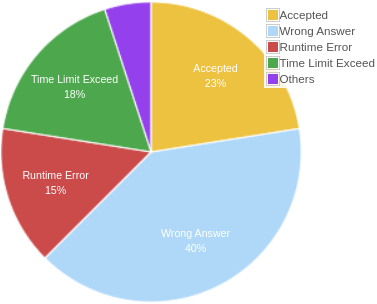

# coding-challenges

My own solutions to various coding challenges from websites such as HackerRank, LeetCode, Exercism, etc.

## Codechef

CodeChef is an Indian-based competitive programming [website](https://en.wikipedia.org/wiki/CodeChef) that provides hundreds of challenges. You are able to write code in their online [editor](https://www.codechef.com/ide) and view a collections of challenges that are separated into different categories depending on your skill level (see [example](https://www.codechef.com/problems/TREEFUN)). They have a large community of coders that contribute to the forums, write [tutorials](https://www.codechef.com/wiki/tutorial-paying), and take part in CodeChef’s coding [competitions](https://www.codechef.com/contests/).

It's perfect for the **intermediate-advanced** programmers who want to learn and extend their skills by competing. Once your DS and algo knowledge is all tuned up right, go for CodeChef. Notice that it doesn't rate you on your practice questions.

Your rank on CodeChef is also matter for companies like Amazon.

###### Pros

- The contests that this site hosts are some of the best coding contests in the world, like the **long challenge** (the best contest), cook-off, etc. Here you get to compete with some of the best coders in the world.
- It has great editorials. If you want to learn, make sure you tried every problem and grasped their tutorials.
- Codeforces has great problems and tougher competition.

###### Cons

- Can be frustrating for beginners.

###### Achievements

- ...

## Codeforces

Codeforces is a Russian-based competitive programming [website](https://en.wikipedia.org/wiki/Codeforces) that regularly hosts competitions where some of the [best](http://codeforces.com/profile/tourist) competitive programmers in the world compete online. If you’re a beginner coder, their challenges will most likely be too advanced for you — here are [some](http://codeforces.com/problemset/problem/908/C) [example](http://codeforces.com/problemset/problem/908/C)s of recent challenges. Their challenges usually require advanced math and algorithms knowledge.

It's perfect for the **advanced** programmers.

###### Pros

- Codeforces has great problems and tougher competition.

###### Cons

- 

###### Achievements

- ...

## Exercism

Exercism is targeted at people with some programming experience (or total beginners) who want to deepen their knowledge or learn new languages. The platform provides thousands of exercises spread across over 50 language tracks, and offer both automated and human mentoring (mentorship is great!).

Exercism is 100% free. It is entirely open source and relies on the contributions of thousands of volunteers. The platform is designed to be fun and friendly, and the authors place a strong emphasis on empathetic communication.

It's perfect for the **beginners-intermediate** programmers.

###### Pros

- There are many interesting problems on topics from different fields of science.
- Besides, there are many tracks for learning various programming languages. There are plenty of them! I even found "Emacs Lisp" I want to learn!

###### Cons

- If the track is oversubscribed, you can't program in the Mentored Mode. For example, C track.
- Achievements would be a great addition, because I can't understand what I should add to the paragraph below.

###### Achievements

Accepted  submissions from Practice Mode:

- C: 1 / 66.
- Java: 2 / 109. 

Approved submissions by mentor from Mentored Mode: 

- ...

## GeeksForGeeks

GeeksforGeeks has the [best collection](https://www.geeksforgeeks.org/fundamentals-of-algorithms/) of articles, explanations, and code solutions for algorithms and data structure topics. You can see an [example here](https://www.geeksforgeeks.org/shortest-common-supersequence/) of how they break down a complex question into simpler parts, explain the solution and then provide a code solution. They also have an online [editor](https://practice.geeksforgeeks.org/problems/rotate-a-linked-list/1) where you can practice solving challenges yourself before seeing the solution.

If you are preparing for a software engineering interview, you should definitely use this website to prepare and brush up on the harder algorithm questions. This site is for **intermediate-advanced** programmers.

###### Pros

- There are many great articles on DSA and problem solving. A lot of people recommend this [article](https://www.geeksforgeeks.org/top-algorithms-and-data-structures-for-competitive-programming/#algo4) for those who want to become more experienced in competitive programming. 
- There are many different coding questions from various companies. The most interesting of them are collected in this [article](https://www.geeksforgeeks.org/must-do-coding-questions-for-companies-like-amazon-microsoft-adobe/?ref=feed).

###### Cons

- UI isn't that attractive.
- You need to log in in order to avoid the notification after the opening of the site.

###### Achievements

- ...

## HackerEarth

When you are familiar with all the concepts of algorithms, data structures and coding in general, try HackerEarth. This site you use when you are transitioning from a beginner to a pro (**intermediate** level).

###### Pros

- It provides brief tutorials for almost all types of problems in practice section.
- The Code Monk of Hackerearth is good too, which provides you first the necessary theory followed by some questions to solve.
- It hosts a plethora amount of contests including a large number of hiring challenges.

###### Cons

- The quality of problems on HackerEarth isn't good enough. HackerEarth simply have few of domains and level of questions is either too easy or too hard for interview rounds. The shift is very drastic and thus fail to provide an adequate level.

###### Achievements

## HackerRank

HackerRank focuses on computer science topics so it provides challenges for several domains such as Algorithms, Mathematics, SQL, Functional Programming, AI, and more. You can solve all the challenge directly online (see [example](https://www.hackerrank.com/challenges/simple-array-sum)). They provide a discussion and leaderboard for every challenge, and most challenges come with an editorial that explains more about the challenge and how to approach it to come up with a solution.

Also, Interview Preparation Kit was recently added. 

The site is great for **beginners**.

###### Pros

- Categorization of problems according to language and topic.
- Tutorials are useful.
- Nice editorial and discussion page.
- Very interactive and attractive UI.

###### Cons

- Problem statements on HackerRank have very detailed descriptions. Imagine an easy task that should be solved in two minutes, and you read its description 5-10 minutes.
- You need to unlock additional test cases.
- Not all test cases can be used. There is a limit on the size of the test case you want to run. So, you unlock the test case, spend hackos, and you can't use it :)
- There is no "diff" feature for the results of test cases. You need to open several files to see if your test case failed.
- Competitions are too rare.

###### Achievements

> Link to profile: [link](https://www.hackerrank.com/vladkinoman).

- Problem solving badge (silver level):

## InterviewBit

GeeksforGeeks, Leetcode, Interview Bit and such platforms are more apt and fitted for coding rounds. With lots of concepts and problems related to them, each domain has variety of questions to practice and master.

Level is **intermediate-advanced**.

###### Pros

- Top rated questions are great.
- There are many great and free questions from various companies.
- There is a time tracking during the solution of the problem.

###### Cons

- 

###### Achievements

- ...

## LeetCode

LeetCode has a collection of some of the best algorithm challenges online today. The topics they cover require knowledge of data structures such as binary trees, heaps, linked lists, etc., which is why their challenges are a bit more advanced than some other websites — but the challenges are great if used when preparing for a software engineering interview.

They also have a [Mock Interview](https://leetcode.com/mockinterview/) section that is specifically for job interview preparation, they host their own coding [contests](https://leetcode.com/contest/), and they have a section for [articles](https://leetcode.com/articles/pour-water/) to help you better understand certain problems.

Level is **intermediate-advanced**.

###### Pros

- There are many interesting problems on the "Algorithms and Data Structures" topic.
- Contests are interesting and not uncommon.

###### Cons

- All submissions you submit are added to your statistics in the profile which might be viewed by various people. So, in order to save your statistics, you should be careful with your submissions, test them carefully, and create your own test cases. This is not very, but can provide an additional challenge.
- Some tutorial solutions are too complicated — you can solve some of the problems in a simple way.
- The questions of the famous companies are closed until you buy the premium.

###### Achievements

> Link to profile: [link](https://leetcode.com/vladkinoman/).

- Ranking: :star:
- Points:  280.
- Finished contests: 1.
- Solved Question: 9 / 1246.
- Accepted Submission: 18 / 80.
- Acceptance Rate: 22.5 % (18 vs. 62).

## TopCoder

TopCoder is one of the original platforms for competitive programming online. Their popular Single Round Matches are offered a few times per month at a specific time where you compete against others to solve challenges. Here are some [topics](https://www.topcoder.com/community/data-science/data-science-tutorials/) (it's popular article) that their challenges may cover.

Aside from solving challenges for fun online, they offer sponsored competitions where you can [win prizes](https://www.topcoder.com/challenges/) for writing the best solution.

Your rank on TopCoder is also matter for companies like Amazon.

Level is **intermediate-advanced**.

###### Pros

- Weekly challenges are interesting.

###### Cons

- UI isn't that friendly.
- I caught a few bugs when I used this site :)

###### Achievements

- ...

## References

1. [The 10 Best Coding Challenge Websites for 2018](https://medium.com/coderbyte/the-10-best-coding-challenge-websites-for-2018-12b57645b654)
2. [10 самых популярных сайтов для соревнований программистов на начало 2018 года — russian translation](https://habr.com/ru/company/cloud4y/blog/346838/)
3. [Which is better codechef or HackerRank or HackerEarth?](https://www.quora.com/Which-is-better-codechef-or-HackerRank-or-HackerEarth)
